<h1 align="center">🎮️ U Help U 🎮️</h1>

Two selves. One timeline. 
Record. Replay. Cooperate. Escape.

<a href="https://uob-comsm0166.github.io/2026-group-13/Demo1">
  <figure style="text-align:center;">
    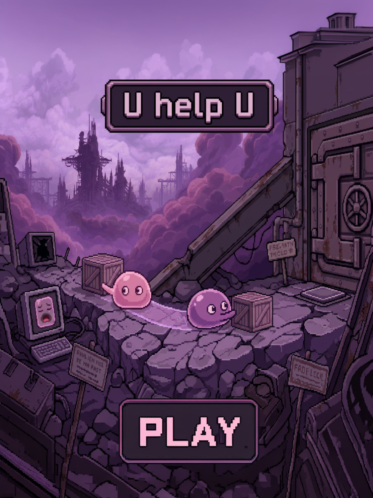
    <figcaption></figcaption>
  </figure>
</a>

<h1 align="center">📽️ Gameplay Preview</h1>

 
 
 

<h1 align="center">👥 Team Members</h1>

<figure style="text-align: center;">
  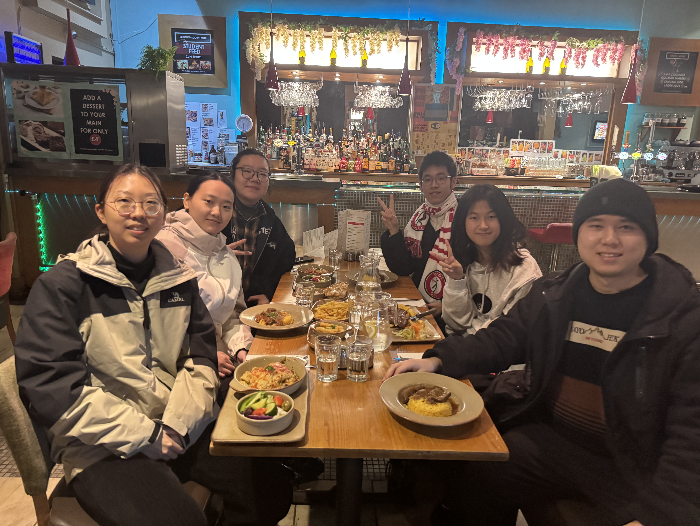
  <figcaption></figcaption>
</figure>

<table align="center">
  <tr>
    <th>Name</th>
    <th>Email</th>
    <th>Role</th>
  </tr>
  <tr>
    <td>Zhiqing Zhang</td>
    <td>ek25873@bristol.ac.uk</td>
    <td>role</td>
  </tr>
  <tr>
    <td>Siqi Xu</td>
    <td>lv25773@bristol.ac.uk</td>
    <td>role</td>
  </tr>
  <tr>
    <td>Xuelin Ma</td>
    <td>pw25500@bristol.ac.uk</td>
    <td>role</td>
  </tr>
  <tr>
    <td>Yiyuan Yao</td>
    <td>jg25755@bristol.ac.uk</td>
    <td>role</td>
  </tr>
  <tr>
    <td>Jingran Zhang</td>
    <td>sx25997@bristol.ac.uk</td>
    <td>role</td>
  </tr>
  <tr>
    <td>Wenlei Miao</td>
    <td>hz25681@bristol.ac.uk</td>
    <td>role</td>
  </tr>
</table>

 
 

<h1 align="center">📑 Project Report</h1>

## 🗂️ Table of Contents

- [Introduction](#️-introduction)
- [Requirements](#️-requirements)
- [Design](#️-design)
- [Implementation](#️-implementation)
- [Evaluation](#️-evaluation)

## ⚙️ Introduction
***U Help U***

*U Help U* is a 2D side‑scrolling platformer puzzle game built around the concept of **self‑collaboration**. Players control the “Present Self” to record actions, and upon playback, a “Past Self” is generated. This Past Self faithfully reproduces the recorded inputs and physics‑based trajectory, acting as a **solid cooperative unit** that can interact physically with the Present Self—standing on each other, boosting each other, and enabling creative traversal strategies.

The game contains no enemies. Its core challenge lies in predicting and coordinating the interaction between past and present actions, delivering the thematic experience that **“every attempt has value—your past efforts become the foundation for your present success.”**

Each level is a standalone challenge. After completing one, players proceed to the next.

---

### Core Gameplay (How to Play)

#### 1. Basic Controls  
- **Movement**: A / D  
- **Jump**: W or Space  
- **Record / Replay**: R  

#### 2. Three Core Modes (Closed‑Loop System)

#### (1) Exploration Mode  
The player controls the Present Self to explore the terrain, observe obstacles, and plan the route that the Past Self must follow.  
- Affected by gravity  
- No Past Self exists yet  
- Focus on observation and planning  

#### (2) Recording Mode  
Activated by pressing R. A “Recording” indicator appears, and a 10‑second recording begins. The system records **input commands**, not fixed positions.  
- Present Self moves freely  
- Players create “useful collaborative trajectories”  
- Press R again or wait for the timer to end  
- Playback begins automatically  

#### (3) Collaborative Replay Mode  
A Past Self is generated and replays the recorded actions using real‑time physics.  
- Present Self remains controllable  
- Past Self follows recorded inputs under gravity  
- Both entities can stand on each other  
- Press R to interrupt and re‑record  
- Past Self disappears when playback ends  

#### 3. Physical Rules  
- Both selves are affected by gravity  
- Both can stand on floors, platforms, or each other  
- Vertical stacking allowed; horizontal overlap prevented  
- Both are solid, impenetrable units  

---

### Game Goals

#### 1. Level Objectives  
- **Primary**: Reach the designated endpoint  
- **Advanced**:  
  - Complete with the fewest recordings  
  - Achieve a perfect one‑take recording  
- **Hidden**:  
  - Collect **Time Shards** in elevated or hidden locations  

#### 2. Core Experience Goals  
- Create the feeling of “collaborating with your past self”  
- Encourage spatial reasoning and forward planning  
- Reinforce the theme that past efforts empower present breakthroughs  

---

### Core Highlights (Differentiation)

#### Immersive Past–Present Integration  
- **Action‑Based Recording**: Playback uses real‑time physics, not scripted positions  
- **Bidirectional Interaction**: Both selves can serve as platforms for each other  
- **Non‑Punitive Design**: No time limits or death penalties  
- **Visual Clarity**:  
  - Present Self: solid white  
  - Past Self: translucent blue  
  - Background: pink  
  - UI labels: “NOW” and “PAST”  

## ⚙️ Requirements 

### Overview

- [1 Ideation process](#1-ideation-process)
- [2 User Stories](#2-user-stories)
- [3 Onion Model](#3-onion-model)
- [4 Early-stage Design](#4-early-stage-design)
- [5 Use-Case Diagram](#5-use-case-diagram)
- [6 Requirements Definition](#6-requirements-definition)

### **1 Ideation process**:
During the first stage of our game design, the first problem that came to us was which type of games we should choose. Each member of our group did detailed research about the specific game type he or she wanted to design, and finally carried out six ideas(each member with one idea). Then our group arranged a meeting and played all the games that could serve as prototypes for our game. The original ideas include Roguelike, Tower Defense, Simulation, PvP, puzzle-solving, etc. And after several hours of discussion, we finally decided to design a 2D platform puzzle-adventure game.

However, a distinctive characteristic of our game is an important part that sets it apart from others. While trying various puzzle games, a game called U vs U attracted us, which has the key game mechanics that players need to find ways to escape from their past selves or kill them before their past self reaches the finish line. That is really an amazing mechanic that only needs one player, but needs to think from two different sides. And the concept of two selves existing in different times and spaces is also quite novel. As a result, we finally decided on the final idea of our game: U help U, a 2D platform puzzle-adventure game in which the player can release a clone through an operation called recording. The clone will replay all the movements and operations that were done by the player during recording time, just like the player’s phantom(The principle behind the recording is to capture each key press during the recording time, and let the clone repeat the movement caused by these key presses during replay time). What the player needs to do is to cooperate with the clone to clear each level. In our initial concept, we can design each level with a different style, so that the player can play various kinds of games in our game.

### **2 User Stories**:
Based on this initial game idea, we formulated a series of user stories to help us prioritize the tasks. Our user stories are based on the format “As a __, I want to __, so that__”, to consider different requirements from different sides. Here are some crucial user stories on basic game controls, core game mechanics, game interactions, and user interface. Click [here](./DevLog/Week04/Requirements-v2.0.md) to view the full user stories, the epics we developed in the early stages, and their completion status.
<figure style="text-align: center;">
  
  <figcaption>Table 1: A Few User Stories</figcaption>
</figure>

In addition to player-centred user stories, we also considered requirements from the perspectives of designers and developers. This helped us ensure that the game would not only be enjoyable for players, but also practical to extend, balance, and maintain during development.
Overall, these user stories provided a structured way to translate our initial game concept into a clearer set of development goals. They helped us identify the most important gameplay expectations from different perspectives, prioritise key tasks during development, and ensure that both player experience and project maintainability were taken into account. They also served as a bridge between the early design idea and the more detailed functional and non-functional requirements defined later in the project.

### **3 Onion Model**:
<figure style="text-align: center;">
  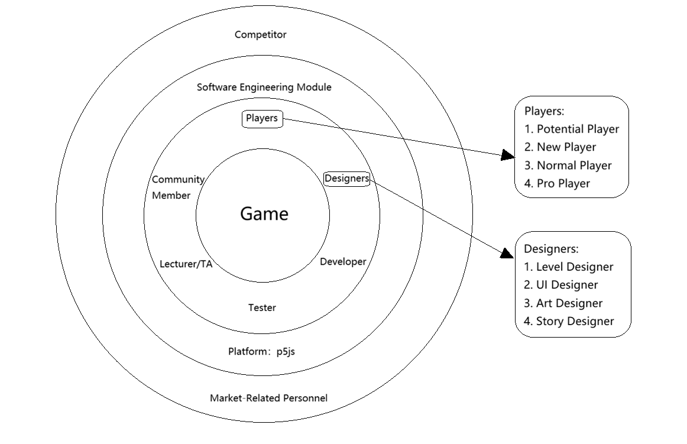
  <figcaption>
    Figure 1: Onion Model: Stakeholders
  </figcaption>
</figure>
The stakeholder onion model was also used to identify the main groups involved in or affected by the game, and to clarify their different roles and levels of influence throughout our project.
<figure style="text-align: center;">
  
  <figcaption>Table 2: Stakeholder in Onion Model</figcaption>
</figure>

### **4 Early-stage Design**:
During our early design stage, we mainly focused on designing different levels with various gameplay styles, such as roguelike in one level and shooting in another, but all combined with the record and reply mechanism. Because there are still some great ideas and map designs that were carried out by some group members. In this way, players can not only focus on puzzle solving using clones, but also can enjoy other different kinds of game styles in only one game. But with the deepening of research and development, we find that the game as a whole seems a bit disjointed. If each stage uses a different style, it seems that it is hard to find a suitable theme for the whole game. So we changed the development strategy to only focus on puzzle solving with the record system.

In our first sprint(first demo version), we mainly focused on creating one level with a relatively easy puzzle(two buttons, the player and clone need to press them at the same time) to let players and testers get familiar with the game mechanics and how to cooperate with the record & replay system. For players who are more confident in their gaming skills, we also developed a level where players need to time their use of clone as stepping stones carefully to cross the chasm.

### **5 Use-Case Diagram**：
<figure style="text-align: center;">
  
  <figcaption>Figure 2: User-Case Diagram</figcaption>
</figure>
Above is our user-case diagram and the following table summarizes the main purpose and design value of it: 
<figure style="text-align: center;">
  
  <figcaption>Table 3: User-Case Diagram Table</figcaption>
</figure>

### **6 Requirements Definition**：
We attended each lab and testing marathon, gathering advice and feedback from different testers and players. After weekly meetings and bug fixing, our finalized functional and non-functional requirements are as follows: 
<figure style="text-align: center;">
  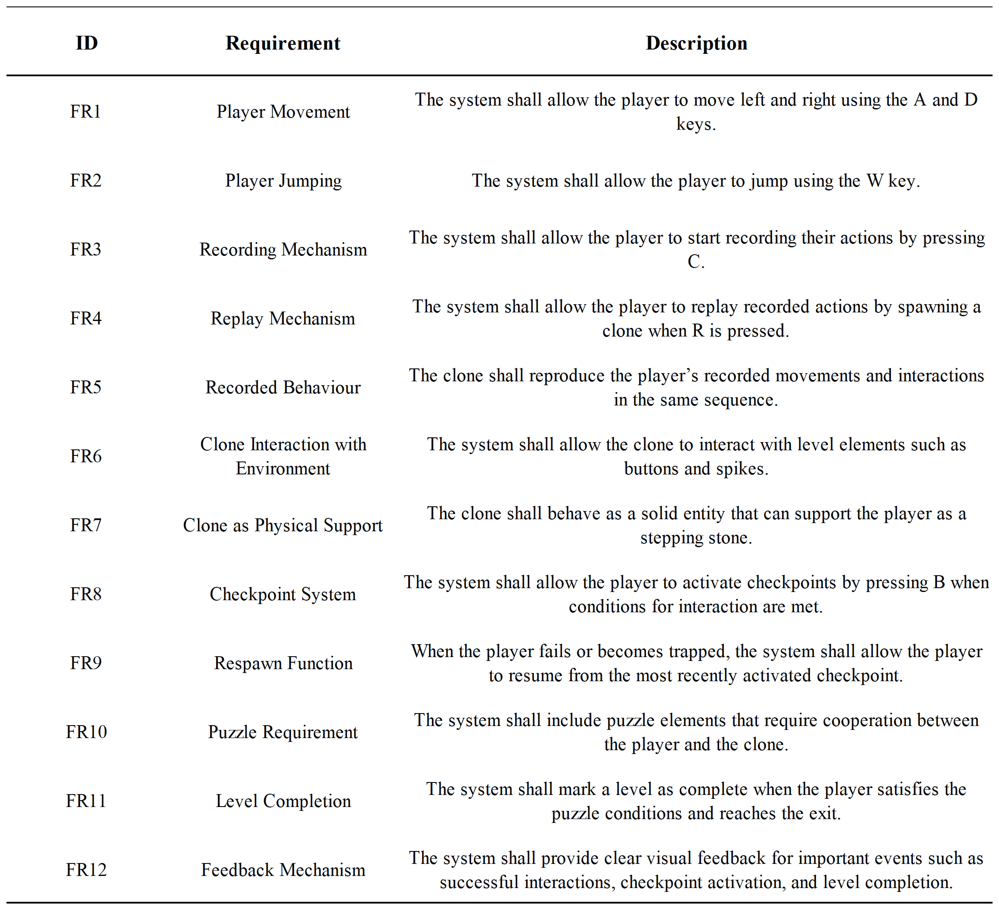
  <figcaption>Table 4: Functional Requirements for U help U</figcaption>
</figure>
<figure style="text-align: center;">
  
  <figcaption>Table 5: Non-Functional Requirements for U help U"</figcaption>
</figure>

## ⚙️ Design

### Overview

- [1 Top Level Architecture](#1-top-level-architecture)
  - [1.1 Event System](#11-event-system)
  - [1.2 Level Manager](#12-level-manager)
  - [1.3 Page Switcher](#13-page-switcher)

- [2 Core Runtime Loop of Level Execution](#2-core-runtime-loop-of-level-execution)
  - [2.1 Game Entity System](#21-game-entity-system)
  - [2.2 Collision System](#22-collision-system)
  - [2.3 Character Control System](#23-character-control-system)
  - [2.4 Physics System](#24-physics-system)
  - [2.5 UI System](#25-ui-system)

- [3 Mechanism Systems](#3-mechanism-systems)
  - [3.1 Record System](#31-record-system)
  - [3.2 Environmental Mechanisms](#32-environmental-mechanisms)

### **1 Top Level Architecture**:

<figure style="text-align: center;">
  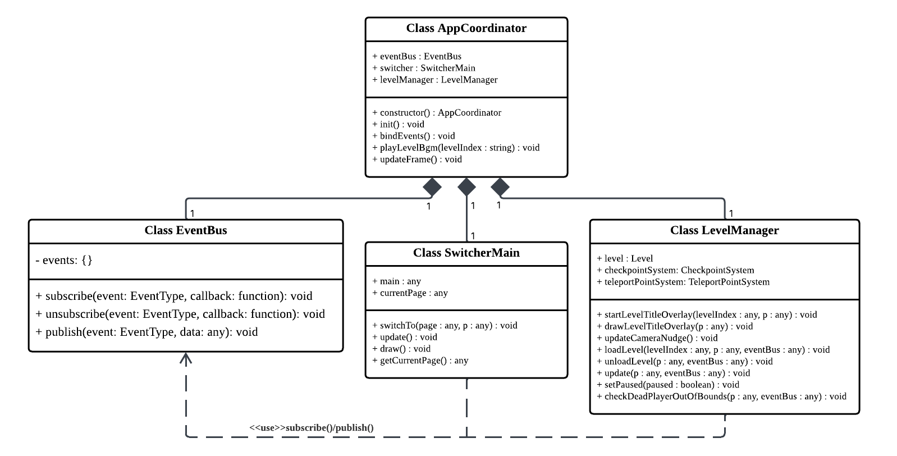
  <figcaption>Figure 1</figcaption>
</figure>

This class diagram illustrates four core classes in the game and their collaboration: AppCoordinator, EventBus, SwitcherMain, and LevelManager, which are responsible for overall orchestration, event dispatching, page switching, and level management respectively.

<figure style="text-align: center;">
  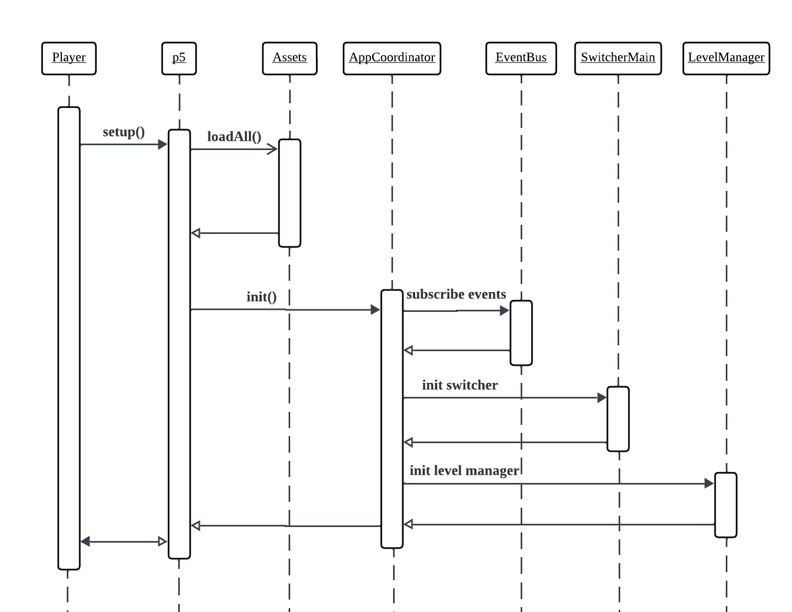
  <figcaption>Figure 2</figcaption>
</figure>

The sequence diagram shows the initialization order of these four core classes during game startup. 

#### **1.2 Level Manager**:

<table>
  <tr>
    <th>EventType</th>
    <th>Description</th>
  </tr>
  <tr>
    <td>LOAD_LEVEL</td>
    <td>Requests loading a specific level and entering gameplay.</td>
  </tr>
  <tr>
    <td>UNLOAD_LEVEL</td>
    <td>Requests unloading the current level and clearing resources.</td>
  </tr>
  <tr>
    <td>RETURN_LEVEL_CHOICE</td>
    <td>Returns to the level‑selection screen.</td>
  </tr>
  <tr>
    <td>AUTO_RESULT</td>
    <td>Triggers level result evaluation (win or lose).</td>
  </tr>
  <tr>
    <td>PAUSE_GAME</td>
    <td>Pauses all gameplay updates.</td>
  </tr>
  <tr>
    <td>RESUME_GAME</td>
    <td>Resumes gameplay updates.</td>
  </tr>
  <tr>
    <td>SIGNBOARD_INTERACTED</td>
    <td>Player interacts with a signboard to display its message.</td>
  </tr>
  <tr>
    <td>SIGNBOARD_OUT_OF_RANGE</td>
    <td>Player leaves signboard range and the message is hidden.</td>
  </tr>
  <tr>
    <td>NPC_DIALOGUE_START</td>
    <td>Begins an NPC dialogue sequence.</td>
  </tr>
  <tr>
    <td>NPC_DIALOGUE_NEXT</td>
    <td>Advances to the next line of NPC dialogue.</td>
  </tr>
  <tr>
    <td>NPC_DIALOGUE_END</td>
    <td>Ends the NPC dialogue and returns control to the player.</td>
  </tr>
</table>

The event system adopts a publish–subscribe model to centrally manage the dispatching of game events. 

#### **1.2 Level Manager**:

<figure style="text-align: center;">
  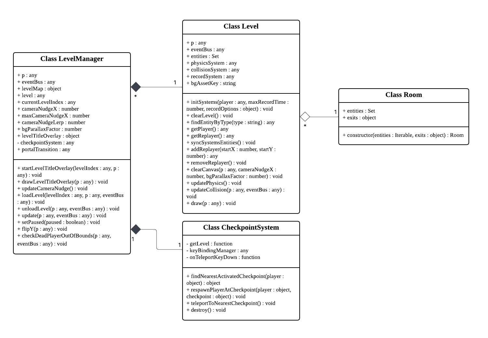
  <figcaption>Figure 3</figcaption>
</figure>

The LevelManager handles orchestration, Level executes level logic, CheckpointSystem manages respawn points, and Room represents spatial partitions within a level.

#### **1.3 Page Switcher**:

<figure style="text-align: center;">
  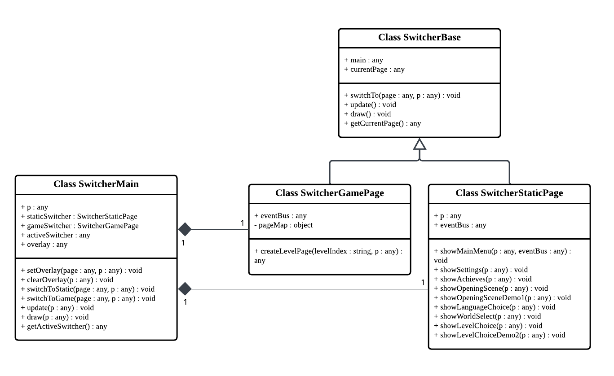
  <figcaption>Figure 4</figcaption>
</figure>

The Switcher is responsible for switching between static UI pages and level pages, and forwarding update and draw calls to the currently active page.

### **2 Core Runtime Loop of Level Execution**:

<figure style="text-align: center;">
  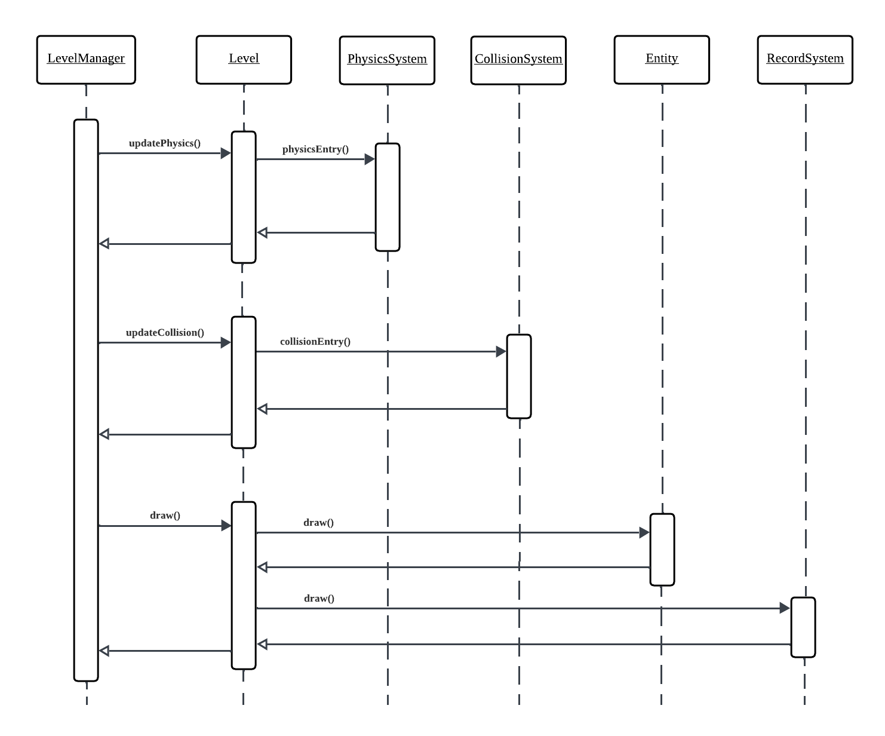
  <figcaption>Figure 5</figcaption>
</figure>

The sequence diagram illustrates the execution order of the game’s main loop: each frame calls update() to refresh system states, followed by draw() to render the interface.

#### **2.1 Game Entity System**:

<figure style="text-align: center;">
  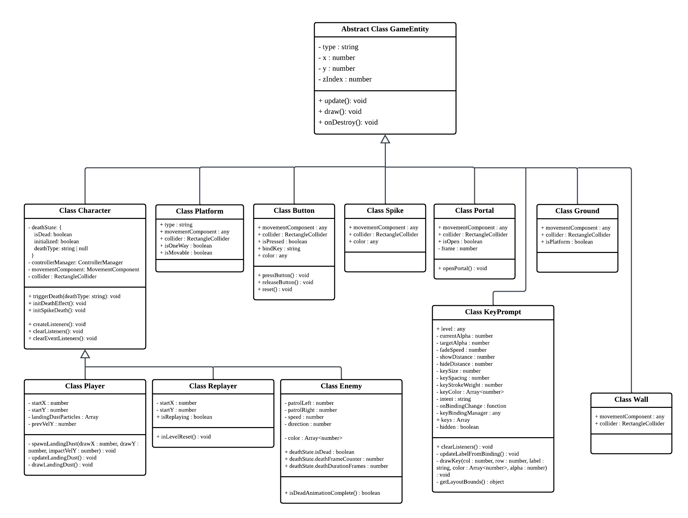
  <figcaption>Figure 6</figcaption>
</figure>

The Game Entity System defines all in game entities, providing unified data structures, shared behaviors, and consistent interfaces for characters, platforms, and interactive elements. The GameEntity base class provides fundamental attributes, while derived classes may include additional components such as collision and control components.

#### **2.2 Collision System**:

<figure style="text-align: center;">
  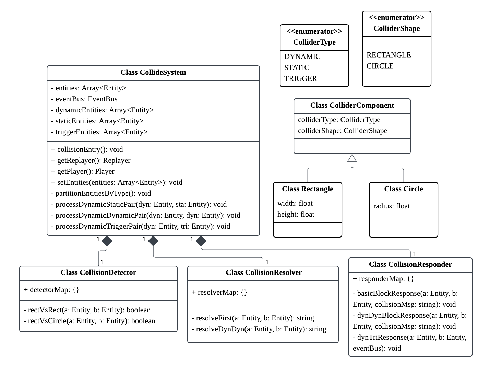
  <figcaption>Figure 7</figcaption>
</figure>

The collision system implements a complete pipeline of collision detection → collision resolution → collision response, ensuring correct physical interactions, trigger events, and blocking behavior between entities.
- CollideSystem orchestrates the entire collision process.
-	CollisionDetector determines whether two entities collide.
-	CollisionResolver determines the collision direction and outputs a collisionMsg for the next stage.
-	CollisionResponder performs the actual response based on the resolved result.

#### **2.3 Character Control System**:

<figure style="text-align: center;">
  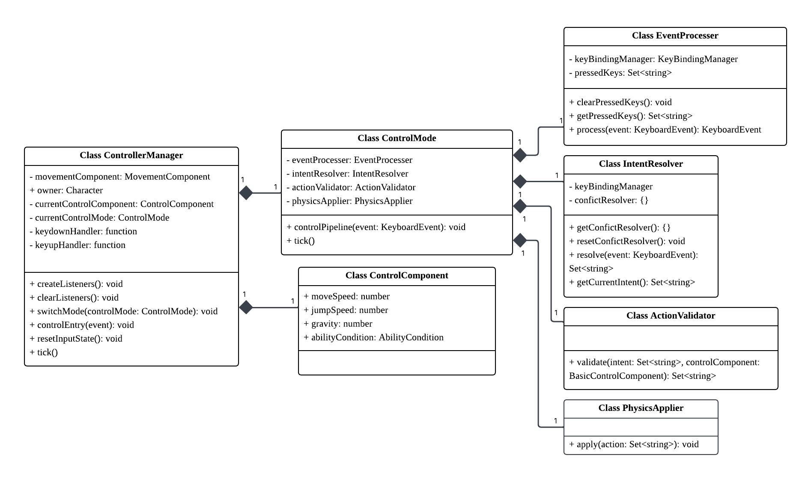
  <figcaption>Figure 8</figcaption>
</figure>

The character control system processes native browser keyboard events, interprets player intent, validates whether the intent can be executed, and maps validated actions to updates of velocity and acceleration in the character’s movement component.

#### **2.4 Physics System**:

<figure style="text-align: center;">
  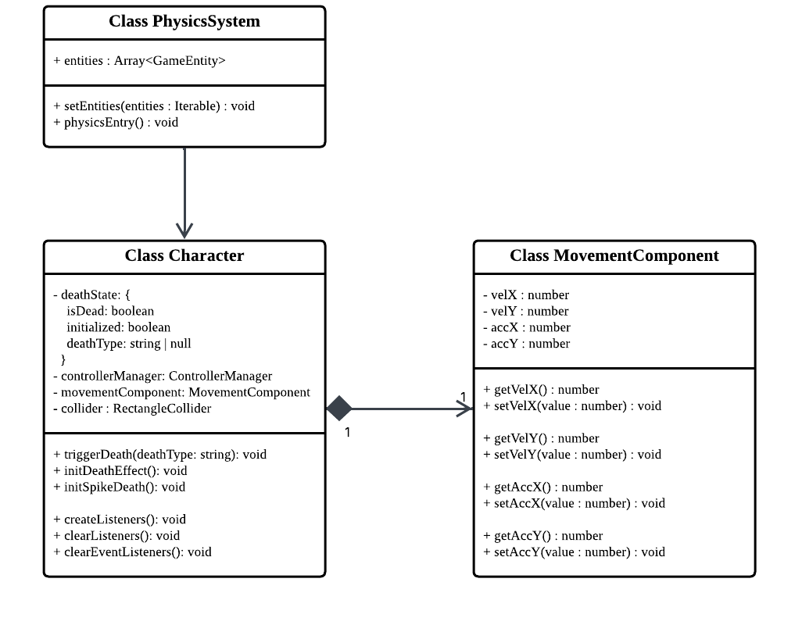
  <figcaption>Figure 9</figcaption>
</figure>

The physics system updates entity positions by applying velocity and acceleration.

#### **2.5 UI System**:

<figure style="text-align: center;">
  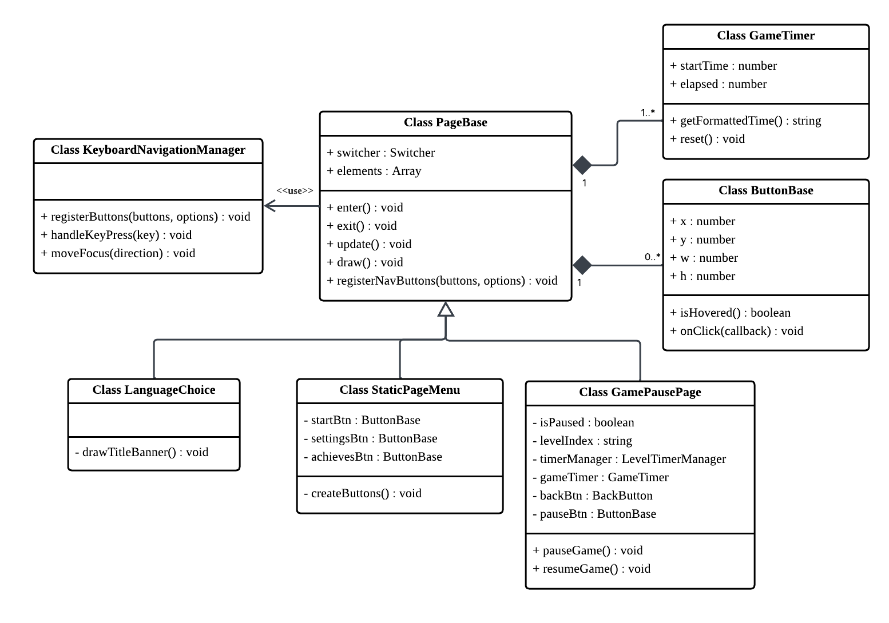
  <figcaption>Figure 10</figcaption>
</figure>

The UI module manages all interface rendering and interaction logic, including static pages, level pages, UI components, and transition effects.

### **3 Mechanism Systems**:

#### **3.1 Record System**:

<figure style="text-align: center;">
  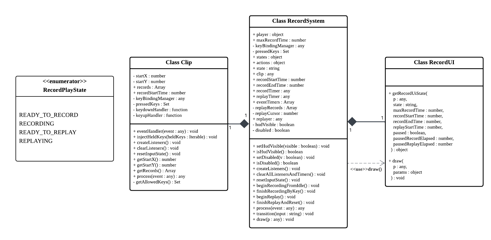
  <figcaption>Figure 11</figcaption>
</figure>

The recording system is the core mechanic of the game. It manages recording states, captures player actions, and replays them. RecordSystem serves as the central component, combining RecordUI for interface rendering and relying on Clip to store recorded data.

<figure style="text-align: center;">
  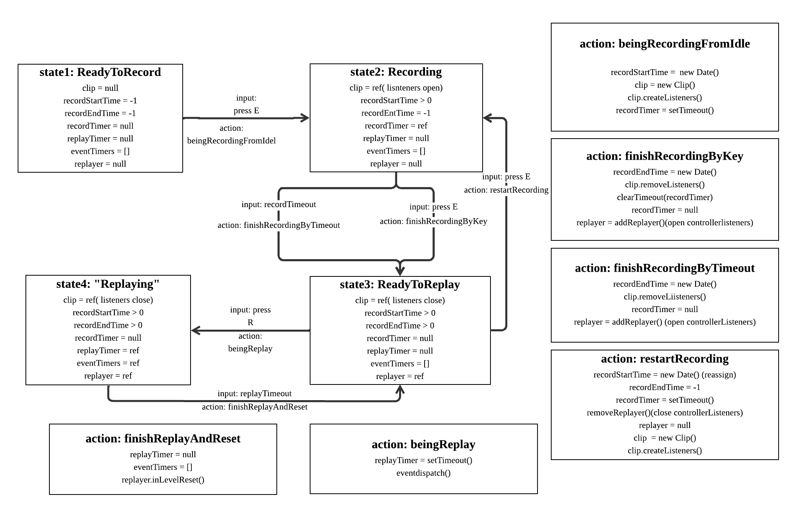
  <figcaption>Figure 12</figcaption>
</figure>

The state machine defines the full lifecycle of the recording system—from Ready to Record, to Recording, to Ready to Replay, and finally Replaying. It ensures that the recording and replay processes are controllable, resettable, and free from state conflicts through explicit states, input events, and action logic.

#### **3.2 Environmental Mechanisms**:

<figure style="text-align: center;">
  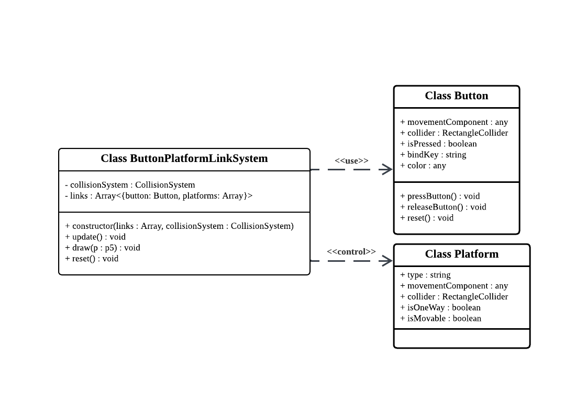
  <figcaption>Figure 13</figcaption>
</figure>

<figure style="text-align: center;">
  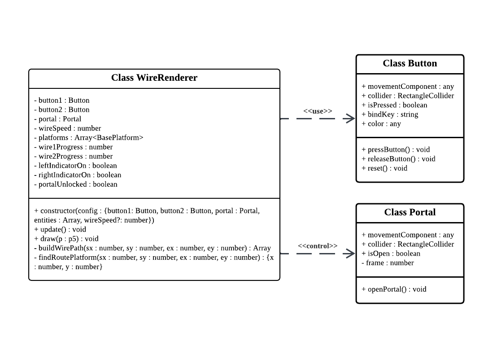
  <figcaption>Figure 14</figcaption>
</figure>

The mechanism system manages reusable level mechanisms, including circuit based door unlocking and controllable moving platforms. Diagram V shows the class structure of the mechanism system: ButtonPlatformLinkSystem and WireIndicatorSystem handle different linkage logics.

---

## ⚙️ Implementation

- 15% ~750 words

- Describe implementation of your game, in particular highlighting the TWO areas of *technical challenge* in developing your game. 

(Draft)

*U Help U* is developed using the p5.js library and follows an object-oriented, modular design approach. Our system architecture encapsulates core game components into distinct classes, including the main player, time-clones, a custom physics engine, and a collision detection system. To deliver the core experience of "collaborating with your past self," we had to overcome several significant technical hurdles during development. Specifically, we highlight the following two primary technical challenges:

**Technical Challenge 1: Deterministic Replay and Physics State Synchronization for Clones**

The core gameplay loop of *U Help U* relies heavily on recording player inputs and generating "ghost clones" to replay these actions for cooperative puzzle-solving. The most critical technical hurdle was achieving absolute "deterministic replay" within the JavaScript/p5.js environment. Initially, we attempted to record the absolute spatial coordinates of the player frame-by-frame. However, due to browser frame rate (FPS) fluctuations and unstable delta times, the clones experienced severe spatial drift during playback. This minor physical deviation led to critical collision failures—for example, a clone narrowly missing a trigger button, or the "Present Self" failing to stand stably on top of the clone.

To resolve this, we abandoned absolute coordinate tracking and designed a robust Input Recorder utilizing a Fixed Time Step. During the recording phase, the system precisely samples the player's input vectors (e.g., key states and durations); during playback, these inputs are re-injected into the real-time physics engine. By implementing this approach, we ensured 100% physical state synchronization and collision accuracy between the main entity and its clones across complex platforming sequences, completely eliminating spatial drift.

**Technical Challenge 2: Decoupling Complex Puzzle Logic via Event-Driven Architecture**

As level designs became more intricate, the game environment incorporated the main player, multiple clones, gravity-sensitive switches, timed doors, and various traps. Initially, managing the interactions between these entities using standard conditional statements (if/else) within the entity classes led to highly coupled, unmaintainable "spaghetti code". This architecture made it exceedingly difficult to debug state changes or introduce new interactive mechanics.

To overcome this architectural bottleneck, we undertook a major refactoring of the game's core interaction logic by implementing an Event-Driven Architecture (specifically, an Event Bus system). The technical complexity lay in designing a centralized event dispatcher that allows all game entities to communicate asynchronously. Under this new architecture, entities no longer reference each other directly. For example, when a player or clone steps on a pressure plate, the plate simply broadcasts a "stepped_on" event; any linked door or trap listening for this event will then independently trigger its respective animation and state change. This decoupled design not only eradicated hard-coded dependencies but also laid the technical groundwork for highly scalable and complex puzzle designs in future development.

---

## ⚙️ Evaluation

- 15% ~750 words
- One qualitative evaluation (of your choice)
- One quantitative evaluation (of your choice) 
- Description of how code was tested. 

### --- Qualitative ---

#### (1) Contextual Onboarding & Bilingual Support

Issue: Players require clearer, real-time guidance on game controls and mechanics. Static instructions are insufficient.

Action Plan: Implement bilingual (English and Chinese) proximity-based tooltips. Following the TA's recommendation, UI prompts (e.g., "Press [E] to interact" / "按 [E] 互动") will dynamically appear when the player's character approaches specific interactive elements, such as buttons or traps.

This aligns with Nielsen's "Recognition rather than recall". By providing contextual instructions exactly when and where they are needed, we significantly reduce the players' cognitive memory load.

#### (2) Learning Curve & Scaffolding (Level 0)

Issue: Transitioning directly into Level 1 introduces too many mechanics at once, causing a steep learning curve for new players.

Action Plan: Design and insert a simple "Tutorial Level" (Level 0) prior to the first official stage. This safe, low-stakes environment will allow players to practice basic movements and test the core mechanics without the threat of failing. It doesn't need to be too complex; it should mainly introduce the game's controls to new players.

This addresses "Error prevention" and enhances "User control and freedom", ensuring players are comfortable with the physics and controls before facing actual challenges.

#### (3) Narrative Context & Conceptual Mapping

Issue: The core gameplay loop (the time-clone mechanic) feels abstract without a narrative foundation.

Action Plan: Introduce a brief narrative sequence or story screen at the start of the game. This will establish the world's lore, explaining the concept of manipulating time and cooperating with one's "past self" and "present self" to solve puzzles.

This improves the "Match between system and the real world". Providing a narrative metaphor (co-op with a past self) makes the complex time-manipulation mechanic more intuitive and mentally accessible for the player.

### --- Quantitative ---

#### Evaluation Findings

We conducted a quantitative user evaluation with 10 participants, using a within-subjects design to compare the user experience between Level 1 and Level 2. Participants completed the NASA Task Load Index (TLX) and System Usability Scale (SUS) after playing each level. We then ran a Wilcoxon Signed-Rank Test (with an alpha level of 0.05) to determine if there were significant differences in perceived workload and usability.

* **System Usability Scale (SUS):** The test yielded **W = 21.0** and **p = 0.857**. Since p > 0.05, there is **no significant difference** in usability between the two levels. Both levels scored well above the industry average of 68 (Level 1 mean: 71.5; Level 2 mean: 73.25). This is a positive outcome, indicating that our core UI and control mechanics remain stable, intuitive, and easy to use regardless of the difficulty progression.

* **NASA Task Load Index (TLX):** The test yielded **W = 10.0** and **p = 0.138**. Since p > 0.05, there is **no significant difference** in perceived workload between the two levels. Although the absolute mean score increased from 37.93 (Level 1) to 46.67 (Level 2), the lack of statistical significance suggests a strong "learning effect." Players mastered the mechanics in the first level, which counteracted the static difficulty increase in the second level.

#### Reconsidered Technical Challenges

Based on the quantitative evaluation results and the core mechanics of our time-clone puzzle platformer, we have reconsidered our primary technical challenges for the ongoing development:

#### Technical Challenge 1: Algorithm-Driven Dynamic Difficulty Adjustment & State Machine Refactoring
* **Context:** Our Wilcoxon Signed-Rank Test for NASA TLX revealed that static level design fails to produce a statistically significant increase in cognitive workload due to player learning effects.
* **Challenge:** Breaking away from hard-coded difficulty scaling by implementing a Dynamic Difficulty Adjustment (DDA) algorithm. The technical hurdle involves building a background system to parse real-time player metrics (e.g., completion time, clone usage efficiency) and refactoring the Finite State Machines (FSM) of environmental hazards and enemies. The FSMs must dynamically interpret DDA parameters to alter attack wind-up frames, movement speeds, or pathfinding algorithms on the fly, ensuring a consistent and measurable escalation of cognitive load.

#### Technical Challenge 2: Deterministic Replay and Physics State Synchronization for Clones
* **Context:** The core gameplay loop relies heavily on recording player inputs and generating "ghost clones" to replay actions for cooperative puzzle-solving.
* **Challenge:** Achieving absolute "deterministic replay" within the JavaScript/p5.js environment. Frame rate (FPS) fluctuations and unstable delta times cause spatial drift if coordinates are simply recorded frame-by-frame, leading to critical physics and collision failures during replay (e.g., a clone narrowly missing a trigger button). The technical complexity lies in designing a robust Input Recorder using a Fixed Time Step to sample and replay input vectors, ensuring 100% physical state synchronization and collision accuracy between the main entity and its clones across complex platforming sequences.

#### Technical Challenge 3: Decoupling Complex Puzzle Logic via Event-Driven Architecture**
* **Context:** As levels become more intricate, managing interactions between the main player, multiple clones, various switches, timed doors, and traps using standard conditional statements (`if/else`) leads to highly coupled, unmaintainable "spaghetti code."
* **Challenge:** Refactoring the game's core interaction logic by implementing an Event-Driven Architecture (such as the Observer pattern or an Event Bus system). The technical difficulty is designing a centralized event dispatcher that allows entities to communicate asynchronously. For example, a pressure plate simply broadcasts a "stepped_on" event, and any linked door or trap listens for this event to trigger its animation and state change. This eliminates direct hard-coded dependencies and lays the technical groundwork for highly scalable and complex puzzle designs.

## ⚙️ Process 
### I. The Tools and The Specific Cooperation Methods We Used 

- **Meetings (In-person and Online):**  
  In-person meetings are conducted after class to facilitate face-to-face discussions, which enhance efficiency and allow for flexible supplementation of any limitations associated with online meetings. Online meetings are primarily held via Tencent Meeting, with at least one full-group meeting per week to synchronize overall progress and strategic direction. Specific issues related to the module will be addressed by the relevant team members at any time as needed.

- **Kanban and Idea Tracking (Notion):**  
  Notion is used for task allocation, progress tracking, and the consolidation of new ideas. Any emerging ideas related to game design or system architecture are recorded in a timely manner, enabling all team members to review and discuss them, and ensuring that valuable insights are not lost in transient chat records.

- **Wechat Group:**  
  The primary channel for rapid information dissemination. Any updates to tasks on Notion are communicated synchronously within the group. Obstacles or urgent issues are raised in the group at the earliest opportunity.

- **Version Control (GitHub):**  
  The only platform to submit all codes and releasing versions.

- **Other Tools:**  
  - Class Diagram Tool — (Lucidchart)  
  - Drawing Tool — (Procreate)  
  - Estimation Tool — (Planning Poker)  
  - Voting Tool — (Online anonymous questionnaire)  
  - Parallel Development — (Git Branching)  
  - AI Assistance — (Copilot, Claude)

---

### II. Role Allocations and Distributions

    

### III. Excellently Executions During The Process

- **Continuous Version Iteration:**  
  A functional demo was completed in the early stages of the project, followed by frequent updates throughout development. Each delivery also constituted a fully playable version, with no incomplete prototypes submitted which follows the idea of delivering working software frequently in Agile method.

    

- **Embracing Changes:**  
  New ideas continued to emerge throughout the development process. Even when changes required modifications to underlying code logic or core gameplay, sometimes involving complete rewrites, we were willing to pursue them. Rather than settling for a sub-optimal version, we prioritized making meaningful improvements.

- **Bold Architectural Refactoring:**  
  Without altering any existing functionality, we repeatedly carried out comprehensive refactoring of the code base to enhance scalability and maintainability. Even in the mid-to-late stages of the project, when structural issues were identified, we committed plenty of time to rewriting, ultimately achieving a clear, well-organized, and extensible code structure.

---

### IV. Challenges Encountered and Adjustments

- **Fragmented Collaboration and Lack of Integration:**  
  In the early stages of the project, team members had limited experience in project development, JavaScript, and game design. As a result, individuals explored independently, leading to siloed work, insufficient communication, and knowledge fragmentation. This was reflected in unclear code interfaces and limited understanding between modules.  
  **Adjustment:** The team transitioned to a module ownership structure, where each member took responsibility for a specific component, overseeing its design, development, and integration while still contributing to other modules. This significantly improved communication, strengthened inter-module coordination, and enhanced integration efficiency in later stages.

- **Loose Progress Management:**  
  Initially, there were no clearly defined deadlines, resulting in a slow and unstructured workflow.  
  **Adjustment:** Deadlines were established for each task, with module owners mutually monitoring and ensuring progress.

- **Inefficient Information Synchronization:**  
  Task updates were recorded only in Notion without proactively informing all members, leaving some unaware of others’ progress and making code integration difficult.  
  **Adjustment:** It was agreed that all Notion updates would be simultaneously communicated in the WeChat group, which noticeably improved responsiveness.

- **Pace Misalignment:**  
  During the project, there were differences in working pace and standards of completion among team members, which is common in diverse teams. Variations in individual approaches occasionally led to misaligned pacing and misunderstandings in collaboration.  
  **Adjustment:** Through ongoing discussions, the team gradually aligned on a shared pace and common goals. Continuous communication helped establish a more consistent workflow, making collaboration smoother and effectively reducing potential misunderstandings.

- **Low Efficiency in Full-team Meetings:**  
  Meetings involving all six members often became unfocused, and the involvement of non-relevant participants led to inefficient use of human resources and slower decision-making.  
  **Adjustment:** A hybrid approach combining full-team and small-group meetings was adopted. Full-team meetings were held weekly to align on overall direction, while specific issues were addressed in smaller meetings of 2–3 members as needed.

---

### V. Others’ thoughts
## ⚙️ Sustainability, ethics and accessibility

## ⚙️ Conclusion

Our project: **U Help U**, successfully transforms an abstract idea into a coherent and playable game. Instead of relying on combat, the game requires players to record the actions of their "present self" and then cooperate with their "past self" to complete levels. The core challenge is one of planning, observation, and spatial reasoning rather than reflex alone.

#### Lessons
- First is that a good game concept alone is not enough; it must be supported by communication between the team and players, a detailed structure, and an iterative mechanism. This helped us move from vague ideas like just "record and replay" toward clearer player-centered goals.

- Second came from the implementation level: When the core mechanics are built upon "precise replay," the technical system becomes an indispensable part of the gameplay itself. Because the loop relies on the "past self" to accurately reproduce previously recorded actions, even minor deviations in timing, collision, or movement can cause level solving to fail. Therefore, shifting from "recording coordinates" to "recording input," combined with a fixed time step, is a fundamental design decision that determines the viability of the gameplay.

- Third concerns software engineering practices. Early development is slow due to over-engineering, with excessive focus on future extensibility before a stable Minimum Viable Product is built. But after that, our team subsequently refined our development strategy by drawing ideas from more mature examples, clarifying interface boundaries, and reorganizing the codebase into clearer modules.

#### Challenges
For technical, it can be summarized as jumping behavior, stacked interactions, box collisions, record-system state management, and level balancing. In game architecture, for example, the inheritance hierarchy of the entity tree is difficult to perfect in a single pass. To solve this, we adopt “generality” as the key criterion for determining ownership. 

Another is teamwork. We initially encountered issues with unclear interface definitions. We then collaboratively refined the shared interfaces, explicitly identifying the key data that needed to be accessed by other systems (position/velocity), as well as the methods that should be exposed for external use (including state updates and input handling).

From design, a key was ensuring that the “record and replay” mechanic did not merely remain novel but was also genuinely intuitive and easy to understand. Thus, we developed a coherent narrative framework supported by in-game signposts, research logs, and guided instructions, helping players recognize that clones should be treated as collaborators.

#### Future
Looking ahead, if we have the chance to develop a larger next version, the project offers many promising directions, such as multi-phase recording, custom level creation, hidden challenge routes, and community-based competition. Building on this foundation, additional features could include in-game shops, cosmetic rewards, pets, AI-guided NPCs, and level sharing systems. The sequel could further develop the game’s worldbuilding. Through elements like signposts, archival records, NPC dialogue, and memory fragments, the concept of “collaborating with your past self” can evolve from a gameplay mechanic into a more emotionally resonant narrative experience.

    

Overall, our project successfully achieved its core creative objective: transforming repetition into something meaningful. Previous attempts are not discarded because of failure but become practical resources for driving progress. Yes, what truly drives progress is never a single perfect attempt, but rather continuous repetition, revisions, iteration, and the value accumulated from all past efforts.

## ⚙️ Contribution Statement

- Provide a table of everyone's contribution, which *may* be used to weight individual grades. We expect that the contribution will be split evenly across team-members in most cases. Please let us know as soon as possible if there are any issues with teamwork as soon as they are apparent and we will do our best to help your team work harmoniously together.

## ⚙️ AI statement